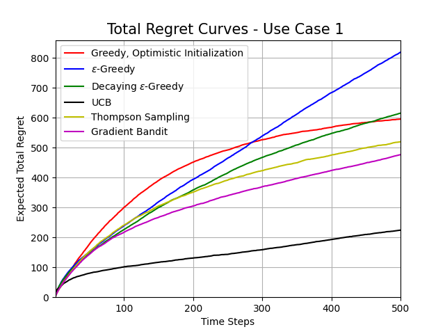
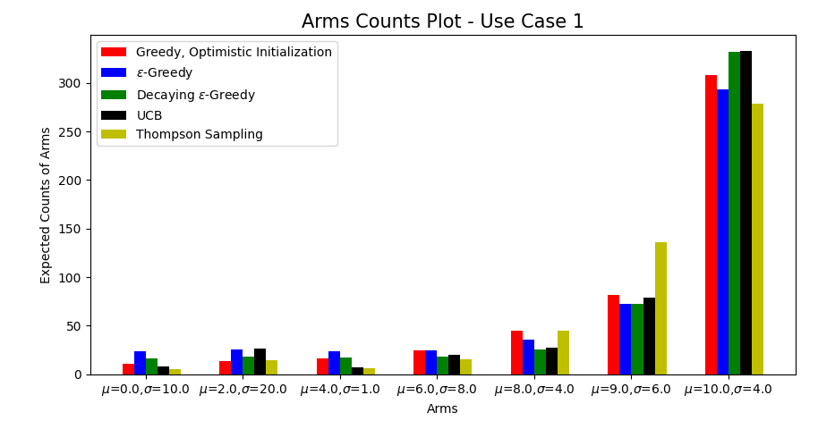
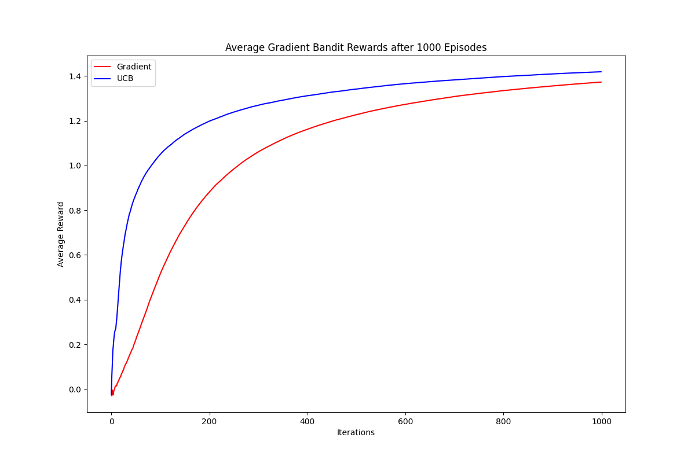

# Multi-Armed Bandits Reinforcement Learning

Source: 
- Book title: Foundations of Reinforcement Learning with Applications in Finance
- Authors: Ashwin Rao, Tikhon Jelvis 

A. In order to execute the horse race experimentation, you must launch the scripts/horseraceexperiment.py file. 

   - To experiment the different described use cases in the report, we must change the arms distribution hyperparamters as well as espilon value. 
   For each run, two plots are generated; one reports the total regrets using the diffrent algorithms and the other one reports the arms counts: 
   
   
   
   
   
B. The file script/gradientbandit_ucb.py is an implementation of the algorithms Gradient Bandit and UCB. The average reward comparison through iterations is shown in the figure below : 

  
